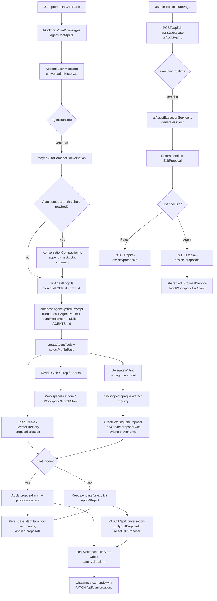

# Architecture Notes for Derived Projects

このドキュメントは、このリポジトリを別のAIエージェント付きエディターへ派生させる開発者向けの設計メモです。理想形ではなく、現在の実装と仕様に沿って、変更しやすい境界と壊してはいけない制約をまとめます。

## 全体構成

アプリはローカル小説執筆ワークスペースを対象に、チャット、エディット、リーダーの3モードを持つWeb/デスクトップエディターです。エディットモードだけがファイルツリー、CodeMirror、単発実行型のAIアシストの3ペイン構成になります。AIアシストは会話を持たず、選択範囲または本文を入力として1回の実行で編集案を返し、適用前にユーザーの承認を求めます。

- UI: `src/routes/__root.tsx`がTanStack Startのroot route、`src/app/App.tsx`がfeatureのhookと共有Contextの組み立て、`src/app/AppShell.tsx`がサイドバーと共通レイアウト、`src/routes/*.tsx`が各ページルートを担当し、`src/app/*RoutePage.tsx`を直接参照します。`src/app/`にはシェル、レイアウト、画面間の共有Context、ページの組み立てと作業モードのルート解決を残します。
- ワークスペース操作: `src/features/workspace/` がパス検証、ファイルストア、検索ストア、テンプレート、ワークスペース選択を担当します。`useWorkspaceSession.ts`が保存済みルートの検証・復元、選択と開始ガイドの判定を、`workspaceSessionStorage.ts`がルートの保存・旧キー互換を担当します。
- エディター: `src/features/editor/` がCodeMirror表示、読み込み、保存APIを担当します。
- AIチャット: `src/features/ai-chat/` が会話API、履歴JSON、会話圧縮、チャットのツール活動表示、編集案と会話履歴の紐付け・自動適用を担当します。
- AIアシスト: `src/features/ai-assist/` がエディット画面の単発実行、ChatGPTプラン・APIキー接続の実行、アシスト定義、編集案のApply/Rejectを担当します。共通の編集案契約とApply/Rejectは`src/features/edit-proposals/`を使います。
- AIエージェント: `src/features/ai-agent/` がAgentProfile、AgentSkillPlugin、AgentToolPlugin、`runAgentLoop`、system prompt合成、執筆委譲を担当します。
- LLM接続・設定: `src/features/llm/` がModelProvider、provider生成、APIキー解決・保存、LLMプロフィール、モデル選択を担当します。`useLlmSettings.ts`と`LlmSettingsContext.tsx`は設定の取得・更新と共有、`llmDisplay.ts`と`llmMainRoleAssignment.ts`は表示用変換とメインロールの選択・更新を担当します。チャット向けpropsの組み立ては`ai-chat/mainLlmChatPaneProps.ts`に置きます。SIWC接続設定の初期化は、LLM設定が既定値を保存する前にAppの組み立て処理から呼びます。
- ChatGPT接続: `src/features/siwc/` が認証・モデルinventoryとSIWC用ModelProviderアダプタを担当します。
- AI検索ツール入力: `src/features/ai-agent/tools/ripgrepTools.ts` がRead/Glob/Grep/SearchのZod schemaとRead実装を持ちます。
- リーダー: `src/features/reader/`が章一覧導出、本文の読み取り専用表示、ルビ・傍点表示を担当します。

チャットとエディット画面のAI実行は別の入口を持ちます。チャットは`POST /api/chat/messages`から共通の`runAgentLoop`（Vercel AI SDK）を実行し、会話履歴へ保存します。エディット画面は`POST /api/ai-assists/execute`から構造化出力を生成し、会話履歴を作らず編集案を返します。ChatGPTプランは`openai-chatgpt` providerで直接接続します。旧Codex CLI連携は撤去し、保存履歴の互換だけを維持します。旧会話への送信・圧縮は拒否し、接続変更は新規会話から行います。



## feature間の依存方向

下位featureは上位featureの実装を参照しません。次の順序は左側が下位で、importは上位から下位へ向けます。

```text
shared → workspace → edit-proposals → llm → siwc → ai-agent → ai-chat / ai-assist
```

- `ai-chat`と`ai-assist`は互いに依存しません。共通のLLM選択契約・選択ロジック・UIは`llm/selection/llmSelection.ts`、`llmModelSelection.ts`、`LlmModelSelector.tsx`に置きます。これらはブラウザから利用でき、サーバー専用moduleを参照しません。
- `UpdatePlan`の項目schemaと型は`ai-agent/agentPlan.ts`が所有し、会話履歴schemaが参照します。
- 検索ストアの入出力型は`workspace/workspaceSearchStore.ts`が所有し、`ai-agent/tools/ripgrepTools.ts`のZod schemaをその契約に適合させます。
- `editor`、`file-tree`、`reader`は`workspace`と`edit-proposals`を参照できます。エディター本文・選択範囲のsnapshot型は`editor/editorTarget.ts`が公開し、`ai-assist`が参照します。
- `settings`の画面は各featureのUIを組み立てる上位です。`settingsStorage.ts`にはユーザー設定の保存・復元を残し、LLM型・schemaは`llm`から直接参照します。localStorageのキーと保存JSONの形は維持します。
- 既定のアプリデータ保存先は`shared/server/applicationStorage.ts`の`defaultServerDataRoot()`で解決し、会話、AIアシスト、ワークスペーステンプレートから直接参照します。このmoduleはサーバー専用です。

結合テストに必要なテストファイルからの横断importは、この依存方向の制約対象外です。依存ルールの自動検査は別タスクで扱います。

## HTTP API composition

本番HTTP composition rootは`src/shared/server/apiRouter.ts`です。現在のcanonical pathは次のとおりです。個別操作の一部は同じpathをHTTP methodまたはrequest bodyの`action`で振り分けます。

- ヘルス: `/health`
- ワークスペース: `/api/workspace/select`、`/api/workspace/validate`、`/api/workspace/template`、`/api/workspace/templates`、`/api/workspace/templates/:id`
- ファイル: `/api/files/tree`、`/api/files/content`、`/api/files/import`、`/api/files/operations`
- 会話とチャット: `/api/conversations`、`/api/chat/messages`
- AIアシスト: `/api/ai-assists`、`/api/ai-assists/:id`、`/api/ai-assists/execute`、`/api/ai-assists/proposals`
- LLM: `/api/llm/providers`、`/api/llm/profiles`、`/api/llm/secrets`、`/api/llm/secrets/:providerId`

会話作成・一覧、編集案のApply/Reject/Undo、手動会話圧縮は`/api/conversations`へ集約されています。チャット生成とストリーミングだけを`POST /api/chat/messages`が担当します。エディット画面のアシスト定義と単発実行・編集案のApply/Rejectは`/api/ai-assists`配下です。ここで列挙したpathは`src/shared/server/apiRouter.ts`の現在のcanonical pathであり、仕様書に残る初期API例とは差異があります。

## ワークスペースとファイルストア境界

ファイル操作の境界は`src/features/workspace/workspaceFileStore.ts`の`WorkspaceFileStore`です。現在の実装は`localWorkspaceFileStore`で、ローカルFS向けに以下をまとめています。

- `createContext(workspaceRoot)`で`resolveWorkspaceRoot`を通し、アクティブなワークスペースルートを実パスへ解決します。
- `readTextFile`、`saveTextFile`、`createFile`、`createDirectory`、`rename`、`delete`、`exists`、`getFileTree`、`getRecentTextFiles`を提供します。
- 書き込み系は`resolveWorkspaceFilePath`を通し、ワークスペース外への脱出と`.`から始まる隠しパスセグメントを拒否します。
- テキスト扱いできないファイルはNULLバイトで拒否します。
- ファイルツリーは既定で`.git`、`node_modules`、`dist`、`.data`などを除外し、呼び出し側から渡されたlimitを守ります。

パス検証の詳細は`src/features/workspace/workspaceFilePaths.ts`と`src/features/workspace/workspacePaths.ts`にあります。派生プロジェクトでクラウドストレージや仮想FSを使う場合も、feature層からは`WorkspaceFileContext`とワークスペース相対パスを渡す形を維持すると差し替えやすくなります。

## 検索ストア境界

検索操作の境界は`src/features/workspace/workspaceSearchStore.ts`の`WorkspaceSearchStore`です。現在の`localWorkspaceSearchStore`はローカル`rg`を使います。

- `glob`は`rg --files`の結果とディレクトリ列挙を合わせ、glob patternで絞り込みます。
- `grep`は`rg --line-number --color never --fixed-strings`を使い、必要に応じてpathやglobを渡します。
- `search`は自然文queryから最大5語の検索語を抽出し、`grep`結果を簡易スコアリングします。
- `Glob`、`Grep`、`Search`は最大10件まで返します。
- シンボリックリンクなどでワークスペース外へ出る結果は除外します。

AI toolのschemaは`src/features/ai-agent/tools/ripgrepTools.ts`、エージェントへ渡すtool定義は`src/features/ai-agent/tools/agentTools.ts`にあります。検索エンジンを置き換える場合は、AI toolの返却shapeと件数制限を変えずに`WorkspaceSearchStore`を差し替えるのが基本です。

## LLM providerとAPIキー管理

LLM provider境界は`src/features/llm/modelProvider.ts`です。`LlmProviderPlugin`がprovider ID、表示名、環境変数名、model候補、`createModel(modelId)`を定義します。現在はDeepSeek、OpenAI、Gemini、Anthropic、OpenAI互換APIを扱います。

`llm`は`siwc`や`ai-agent`を参照しません。`modelProviderApi.ts`は必要なモデルinventoryだけを表す`ConnectedModelInventory`を受け取り、`shared/server/apiRouter.ts`がSIWC serviceを注入します。SIWCのHTTP/SSE検証は`siwc/siwcResponses.ts`に置き、OpenAI SDK生成は`llm/providers/openaiResponses.ts`へ委譲します。`@ai-sdk/*` provider packageのimportは`llm`内に限定します（テスト・evalを除く）。

`ai-agent`は`ModelProvider`からモデルを取得し、`llm/secrets`を直接参照しません。APIキー解決はサーバー側だけで行います。

- 環境変数とbase URLの読み込みは`src/features/llm/runtimeEnv.ts`に集約されています。
- OSシークレットストアは`src/features/llm/secrets/llmSecretStore.ts`です。macOS Keychain、Windows Credential Managerを使い、Linux保存はMVP対象外です。
- `src/features/llm/llmRuntime.ts`が環境変数を優先し、OSシークレットストアからproviderごとのAPIキーを補完します。チャットでは`agentChatApplicationService.ts`がこの境界を利用します。
- クライアントから送れるのはサーバーが許可した`providerId`/`modelId`です。任意のmodel文字列やAPIキー本文を信頼しません。

APIキー本文をクライアント、localStorage、会話履歴、ワークスペース内ファイルへ保存しません。派生プロジェクトでもREADME、サンプル、テンプレート、テストfixtureへ実APIキーを書かないでください。

## AgentProfileとsystem prompt優先順

AgentProfileは`src/features/ai-agent/agentProfiles.ts`で定義します。profileは`id`、`name`、`llmProfileRole`、`systemPrompt`、`activeTools`、`stopWhen`などを持ちます。provider/modelはprofileへ直書きせず、`main`、`writing`、`simple`、`search`の用途ロールから解決します。

現在のprofile構成:

- `chat-mode-agent`: チャットモード専用system promptを持ち、`main-agent`と同じツール群を使うメインエージェント。
- `main-agent`: Read/Glob/Grep/Search/ListSkills/UseSkill/Edit/Create/CreateDirectory/UpdatePlan/DelegateWriting/CreateWritingEditProposal/SpawnSubAgentを使える通常のagent loop用メインエージェント。
- `read-only-sub-agent`: Read/Glob/Grep/Searchだけを使う読み取り専用サブエージェント。
- `workspace-search-sub-agent`: Read/Glob/Grep/Searchだけを使う検索寄りサブエージェント。

`selectProfileTools`はprofileの`activeTools`だけをVercel AI SDKへ渡します。未知tool名はエラーにします。サブエージェントprofileは`SpawnSubAgent`を持たないため、サブエージェントからさらにサブエージェントを起動できません。

system promptは`src/features/ai-agent/context/workspaceInstructions.ts`の`composeAgentSystemPrompt`で次の優先順に合成されます。

1. アプリ固定の安全・操作ルール
2. AgentProfileのsystem prompt
3. 実行日時context
4. 有効化済みAgentSkillの追加指示
5. キャッシュ済みワークスペース構造context
6. 現在の章の参考ファイル候補と章完了時の概要更新context
7. ワークスペース直下`AGENTS.md`
8. 最近更新されたテキストファイルcontext

`AGENTS.md`はワークスペース固有の追加指示ですが、固定の安全ルールより低い優先度です。AGENTS.mdでは安全ルールやtool権限を緩和できません。ファイル境界、proposalを経由する編集方針、モードごとの適用方針、APIキー秘匿、tool件数制限、profileの`activeTools`はクライアント入力や`AGENTS.md`で上書きできません。

## AgentSkillPlugin

AgentSkillPluginは`src/features/ai-agent/agentSkills.ts`で定義されています。`AgentSkillPlugin`は`kind: "agent-skill"`、`id`、`displayName`、`createSkills(context)`を持ち、`createAgentSkillRegistry`で組み込みSkillと合成されます。`AgentSkillPluginContext`はMVPでは`workspaceRoot`だけを含み、ファイル読み書きserviceや外部通信serviceは渡しません。

派生プロジェクト固有の作業手順やドメイン知識を追加する場合は、信頼済みローカルコードでpluginを定義し、`src/features/ai-agent/trustedAgentExtensions.ts`のcatalogへ`skillPlugins`として明示的に登録します。production composition rootはcatalogを`createAgentChatApiHandler`から`runAgentLoop`へ渡します。pluginが返すSkillは組み込みSkillと同じZod schemaで検証され、組み込みSkillや他pluginのSkill IDと衝突した場合はエラーになります。

plugin Skillは`ListSkills`と`UseSkill`から組み込みSkillと同じ一覧・有効化経路で扱われます。ただし、Skillはsystem promptへ合成する追加指示であり、AI toolの登録、tool権限追加、任意コード実行には使いません。`requiredTools`は権限拡張に使わず、実際にVercel AI SDKへ渡すtoolはAgentProfileの`activeTools`で選ばれたものだけです。`ListSkills`と`UseSkill`の返却値にはSkill本文全文を含めません。

## AgentToolPlugin

AgentToolPluginは`src/features/ai-agent/tools/agentTools.ts`で定義されています。`AgentToolPlugin`は`kind: "agent-tool"`、`id`、`displayName`、`createTools(context)`を持ち、`createAgentTools`でcore toolに追加されます。

core tool:

- `Read`: ワークスペース内テキストファイルを読む。
- `Glob`、`Grep`、`Search`: `WorkspaceSearchStore`経由で検索する。
- `Edit`: 既存ファイルへの単一置換の編集案を作る。直接書き込みません。
- `Create`: 新規テキストファイルの作成案を作る。直接書き込みません。
- `CreateDirectory`: 新規ディレクトリの作成案を作る。直接作成しません。
- `UpdatePlan`: 現在の応答中だけ表示する短命Planを更新します。
- `DelegateWriting`: `writing`用途ロールのモデルへ`streamWritingObject.ts`経由で本文生成を委譲します。受信文字数だけを実行中表示へ送り、正常終了・検証済みの本文を公開結果へ含めずrun-scoped registryへ保存します。
- `CreateWritingEditProposal`: opaque `artifactId`から`sourceRole: "writing"`付きのEdit/Create proposalを作ります。
- `SpawnSubAgent`: メインエージェントだけが使う読み取り専用調査委譲です。
- `ListSkills`、`UseSkill`: Skill metadataの一覧取得と、同一run内の次ステップ以降へのSkill指示追加を行います。

plugin toolはcore tool名と衝突できず、既に登録済みのtool名も再登録できません。追加toolを作る場合はAI SDKの`tool({ description, inputSchema, execute })`形式を使い、`execute`内でファイル操作を直接書き込みすぎず、サービス境界へ委譲してください。

AgentToolPluginは信頼済みextension catalogの`toolPlugins`へ登録し、production composition rootから`createAgentChatApiHandler`と`runAgentLoop`へ渡します。登録だけではplugin toolは利用可能になりません。`runAgentLoop`がcatalogの`profileToolGrants`から現在の組み込みAgentProfile IDに明示されたtool名だけをeffective profileの`activeTools`へ追加し、最終的に`selectProfileTools`を通過したtoolだけをAI SDKへ渡します。同じcatalogはrecursive sub-agent runにも渡されるため、サブエージェントも自身のprofile IDに対する明示grantだけを利用できます。grantはクライアントrequest、会話履歴、`AGENTS.md`、Skillの`requiredTools`から追加できません。

catalogはSkill pluginとTool pluginを別配列で保持し、plugin IDを両種別横断で一意にします。pluginのkind、ID、表示名、factory関数とprofile grantはcomposition時に検証し、Skill定義、Skill ID、tool定義、tool名衝突はworkspace contextを組み立てた各agent runの開始前に検証します。既定catalogは空で、拡張を渡さない既存のproduction動作は変わりません。

## AI編集承認フローとチャットモード自動適用

AI編集の実体は`src/features/edit-proposals/editProposalService.ts`の`EditProposal`作成とApply/Rejectです。

チャットの実行経路:

1. `agentChatApi.ts`が入力を検証し、`agentChatApplicationService.ts`へ渡します。会話準備は`agentChatConversationPrepare.ts`、実行は`agentChatAgentExecution.ts`、結果保存は`agentChatRunPersistence.ts`が担当します。
2. AI SDKのtoolsは、編集案の生成をproposal serviceへ委譲します。チャットモードでは`editProposalAutoApply.ts`のserviceがtool実行中にApplyするため、後続toolから適用結果を読めます。
3. 自動Applyの前にpending proposalと復旧snapshotを会話へ保存し、適用結果を直後に確定します。ターン結果保存時には保存済みproposal IDで重複を防ぎ、assistant messageとの関連を補います。残るpending proposalには自動Applyの補完経路があります。`agentChatApi.ts`は実行イベントを`application/x-ndjson`で配信し、ストリームを要求しないクライアントにはJSONを返します。
4. `ChatPane.tsx`が適用結果をカードで表示します。明示的なApply/RejectとUndoは`PATCH /api/conversations`で処理します。APIに残る`mode: "editor"`の非自動適用経路は、現行エディット画面の入口とは別です。

AIアシストの実行経路:

1. `EditorRoutePage.tsx`が現在の保存済み本文または選択範囲を`POST /api/ai-assists/execute`へ送ります。
2. `aiAssistExecutionService.ts`で構造化出力を生成し、対象ファイルのpending Edit proposalを返します。
3. `AiAssistPane.tsx`が今回の編集案を表示し、ユーザーが1件ずつApply/Rejectします。`PATCH /api/ai-assists/proposals`は共通の`editProposalService.ts`を呼び、会話履歴を作成しません。アシスト定義の保存は`aiAssistStore.ts`の別の責務です。

両方の入口は共通Apply serviceの安全検証とconflict確認を利用します。

Apply時にはワークスペース相対パスを再解決し、隠しパスセグメントとワークスペース外脱出を拒否します。既存ファイル編集は`oldText`が現在内容に一度だけ一致する場合に限ります。新規ファイル/ディレクトリは既存衝突時に`conflicted`になります。未保存状態のエディター対象ファイルにはApplyできません。

承認挙動は入口で決まります。チャットモードは自動適用が既定で、エディット画面のAIアシストは1件ずつの承認制です。チャットのAI toolはproposal作成を行い、チャットモードの自動Applyはproposal tool serviceまたは実行結果の永続化中に共通Apply serviceを呼びます。エディット画面のAIアシストは実行時にはファイルへ書かず、ユーザーのApply操作までpending proposalを保持します。

会話JSONへの各append、tool activityやPlanの保存は会話単位の排他内でread-modify-writeを行います。1ターン全体は複数の独立した更新です。`conversationHistory.ts`の`accessConversation`が読み取り、復旧、更新、削除の窓口で、`conversationStorage.ts`がプロセス内キュー、プロセス間のディレクトリロック、同一ディレクトリでの一時JSONからの置換を担当します。

HTTP APIとAI toolsは同じ会話保存窓口を使います。別プロセスからの書き込みにもファイルロックで排他し、約2秒で競合が解けなければエラーとします。ロックの自動横取りはしません。

`editProposalService.ts`は原稿への副作用の直前に`beforeMutation`を呼びます。会話側はそこで予定する結果とUndo全文snapshotを`editRecovery`へ原子的に保存し、原稿変更後の状態保存で記録を解消します。`conversationEditRecovery.ts`は次回アクセス時に原稿を読み、完了結果との一致を確認して履歴だけを確定します。一致しない場合やディレクトリ操作は`conflicted`とし、snapshotを残します。外部変更を復旧処理で書き戻さず、同じproposalの再試行で二重Apply/Undoしません。新規の別proposalは別操作です。

異常終了後は全関連プロセスを止めて対象の空の`.json.lock`だけを削除し、会話を再読込します。JSON内の復旧記録は保持します。次回の排他取得時に孤児`.tmp`も清掃されます。詳細な復旧手順と保証範囲は仕様書の「会話保存の競合・中断と復旧」を参照してください。Windowsでrenameが拒否されたときも既存JSONのunlinkには切り替えません。電源断やネットワークFSの耐久性、別会話や外部プログラムとの原稿の同時書き込み、会話を持たないAIアシストの保存はこの保証に含みません。

## 会話履歴と会話圧縮

`src/features/ai-chat/conversationHistory.ts`がチャットの会話、メッセージ、編集案、tool activity、boundedなtool result summary、Plan、会話圧縮checkpointをJSONへ保存します。会話はワークスペースごとに保存・選択され、エディット画面の単発AIアシストは会話履歴を持ちません。AIアシストの編集案Apply/Rejectは`src/features/edit-proposals/editProposalService.ts`を共通依存として使います。

production chatは`src/features/ai-chat/modelMessages.ts`の`conversation-compaction` strategyを使います。最新checkpoint要約をsystem messageとして先頭へ置き、checkpoint以降の生メッセージだけを続けます。対象assistant turnには、サイズ上限付きの過去tool結果と編集案statusを本文末尾へ合成します。保存済みメッセージ自体は削除しません。

手動圧縮は`PATCH /api/conversations`の`compactConversation` actionです。Vercel実行方式の自動圧縮は`POST /api/chat/messages`でユーザーメッセージ保存後、最新のmain context使用率が設定閾値以上ならLLM実行前に試行します。圧縮対象不足や自動圧縮失敗では通常チャットを継続します。

## リーダーモードのデータフロー

`src/features/reader/ReaderPage.tsx`は`GET /api/files/tree`でワークスペースのファイル一覧を取得し、`src/features/reader/readerChapters.ts`で`小説/第00X章/本文.txt`に一致するファイルだけを章番号順へ並べます。各本文は`GET /api/files/content`で読み、先頭の空でない行を章タイトルとして使います。タイトルを導出できない場合は章ディレクトリ名へfallbackします。

本文表示はワークスペースファイルを書き換えず、`src/features/reader/readerMarkup.ts`と`ReaderInlineContent.tsx`がルビと傍点記法を表示用要素へ変換します。章一覧、前後の章送り、本文コピーだけを提供し、保存や編集APIは呼びません。

## UIルーティングと主要ページ

ルート定義は`src/routes/`です。

- `/`: 保存済みワークスペースの前回作業モードへredirect。記録がない場合は`/chat`。
- `/chat`: 全画面のチャットモード。AI編集は自動適用が既定。
- `/editor`: ファイルツリー、CodeMirror、単発実行型AIアシストの3ペインを持つエディットモード。AI編集案は承認制で、会話は持ちません。
- `/reader`: `小説/第00X章/本文.txt`から章一覧とタイトルを導出する読み取り専用リーダーモード。
- `/settings`: 設定ページ。
- `/templates`: テンプレート管理ページ。
- `/llm-profiles`: LLMプロフィールと用途別割り当ての管理ページ。

`src/app/App.tsx`が`workspace/useWorkspaceSession`と`llm/useLlmSettings`を呼び、共有stateを個別の`WorkspaceContext`、`EditorSessionContext`、`PaneLayoutContext`、`LlmSettingsContext`として提供し、`src/app/AppShell.tsx`が左端サイドバー、route outlet、ワークスペースヘッダーをまとめます。ワークスペース操作ヘッダーは`/chat`と`/editor`だけに表示します。

共有Contextの責務:

- `WorkspaceContext`: ワークスペースルートと開始ガイド。
- `EditorSessionContext`: `useFileSession`の編集セッション、選択パス、未保存状態、再読込通知、画面間のテキスト受け渡し。
- `PaneLayoutContext`: ペイン幅、折りたたみ、リサイズ操作。
- `LlmSettingsContext`: UI設定、LLMプロフィール、providerとシークレットの状態・更新操作。APIキー本文を保持する境界ではありません。

主要コンポーネント:

- `src/features/file-tree/FileTreePane.tsx`: 階層ファイルツリー、フィルター、ファイル操作。
- `src/features/editor/EditorPane.tsx`: CodeMirror、タブ、未保存状態、保存。
- `src/features/ai-chat/ChatPane.tsx`: 会話、モデル選択、tool活動、Plan、編集案。
- `src/features/ai-assist/AiAssistPane.tsx`: アシスト定義の選択・管理、単発実行、今回の編集案のApply/Reject。
- `src/features/reader/ReaderPage.tsx`: 章一覧、章送り、本文表示、コピー。
- `src/features/settings/SettingsPage.tsx`: LLM APIキー状態とUI設定。
- `src/features/llm/profiles/LlmProfilesPage.tsx`: LLMプロフィールと用途別割り当て。
- `src/features/workspace/TemplatesPage.tsx`: ユーザー定義ワークスペーステンプレート管理。
- `src/features/workspace/WorkspaceBar.tsx`: ワークスペースを開く、新規ワークスペース作成、テンプレート選択。

## 派生プロジェクトで変更しやすい箇所

派生先のプロダクト差分は、次の境界に閉じ込めると影響範囲を小さくできます。

- アプリ名、package情報、README: `package.json`、`README.md`。
- 画面文言とナビゲーション: `src/app/App.tsx`、`src/features/*/*.tsx`、`src/routes/*.tsx`。
- 内蔵テンプレートと初期`AGENTS.md`: `src/features/workspace/workspaceTemplateStore.ts`。
- ファイルストア差し替え: `src/features/workspace/workspaceFileStore.ts`と呼び出し元API。
- 検索ストア差し替え: `src/features/workspace/workspaceSearchStore.ts`。
- LLM provider/model候補: `src/features/llm/modelProvider.ts`。
- 環境変数名と読み込み: `src/features/llm/runtimeEnv.ts`。
- APIキー保存先やservice/account名: `src/features/llm/secrets/llmSecretStore.ts`。
- AgentProfile、system prompt、許可tool、サブエージェント構成: `src/features/ai-agent/agentProfiles.ts`。
- AgentSkillPluginとSkill構成: `src/features/ai-agent/agentSkills.ts`。
- AgentToolPluginとcore tool構成: `src/features/ai-agent/tools/agentTools.ts`。
- 編集案のdiff、衝突判定、Apply/Reject: `src/features/edit-proposals/editProposalService.ts`。

仕様を変える場合は`specs/novel-editor-mvp.md`と関連タスクも更新してください。検証は`bun run test`を使います。`bun test`はこのリポジトリのVitest設定を通らないため使いません。

## 変更時に壊してはいけない安全制約

派生プロジェクトで機能を増やしても、次の制約は維持してください。

- すべてのファイル操作は検証済みワークスペースルート配下に限定します。
- クライアントから渡されたパスを信用せず、サーバー側でワークスペース相対パスへ正規化します。
- シンボリックリンクや`..`でワークスペース外へ出るアクセスを拒否します。
- MVPでは`.`から始まるパスセグメントへの編集、作成、削除、rename、Applyを拒否します。
- バイナリに見えるファイル、NULLバイトを含むファイルはテキスト編集対象にしません。
- ファイルツリーは一度に100件まで、AIのReadは最大2000行まで、GrepとSearchは最大10件までにします。
- AI toolはファイルへ直接書かずproposalを作ります。エディットモードはユーザー承認後に1件ずつApplyし、チャットモードは同じ検証済みApply serviceで自動適用してUndoを提供します。
- 未保存状態のファイルへAI編集Applyをしません。
- OpenAI、DeepSeek、Gemini、AnthropicなどのAPIキー本文はサーバー側だけで扱います。
- APIキー本文をクライアント、localStorage、会話履歴、ワークスペース内ファイルへ保存しません。
- `AGENTS.md`やチャット入力からsystem prompt優先順、tool権限、ワークスペース境界、モードごとの適用方針、APIキー秘匿を緩和しません。
- AgentSkillPluginはSkill IDを組み込みSkillや他pluginのSkillと衝突させません。
- AgentToolPluginはcore tool名や既存tool名と衝突させません。
- LLM provider/model selectionはサーバー側で許可済み一覧とAPIキー状態を確認します。
- JSON履歴やAPIリクエスト、AI tool入力はZodで検証します。

## デスクトップpreview配布

`v*` tag pushはmacOS Apple Silicon preview（`aarch64-apple-darwin`）とWindows x64 Store MSIX（`x86_64-pc-windows-msvc`）をGitHub Actions（`.github/workflows/desktop-preview.yml`）で両方buildします。手動実行では`build_macos`と`build_windows_store_msix`から少なくとも一方を選択します。通常の`main` pushでは重いdesktop buildを実行しません。macOS IntelとWindows ARM64向けartifactは生成しません。

preview versionは`package.json`、`src-tauri/tauri.conf.json`、`src-tauri/Cargo.toml`で揃えます。CIはmacOS preview artifactだけに`SHA256SUMS`を生成し、7日間GitHub Actions artifactとして保存します。Windows jobはTauri `--no-bundle` buildからrelease executable、sidecar、ripgrepを集めて、7日間の`windows-store-msix` artifactを生成します。MSI/WiX bundle、Windows preview artifact、Windows SHA256 preview artifactは生成しません。

Cloudflare R2上のpath convention:

- versioned: `ghostwriter/preview/versions/<version>/<target>/<artifact>`
- latest: `ghostwriter/preview/latest/<target>/<artifact>`
- checksum: `ghostwriter/preview/versions/<version>/SHA256SUMS` と `ghostwriter/preview/latest/SHA256SUMS`

R2アップロードは`workflow_dispatch`で`build_macos`と`upload_to_r2`を選んだ場合だけmacOS preview artifactに対して実行し、通常のCIではsecretsを要求しません。Windows Store MSIXはPartner Center提出用でありR2へアップロードしません。アップロード用の環境変数とGitHub secrets名はREADMEと`.env.example`に記載します。認証情報はリポジトリ、ログ、artifactへ平文保存しません。

初回previewでは自動更新を含めません。利用者はR2上の新しいartifactを手動ダウンロードして更新します。macOSとStore外Windowsの署名済み配布・Tauri updaterは、それぞれタスク`054`と`055`で導入します。Microsoft Store版WindowsはStoreの署名と更新配信を利用します。

## Windows Store MSIX

Windows一般リリース用のMSIXは、既存MSIをキャプチャ変換せず、TauriのWindows x64 releaseディレクトリから明示的なlayoutを構築します。`scripts/windows-msix.ts`がPartner Center Identityを持つmanifest、Tauri executable、sidecar、同梱`ripgrep`、Store用visual assetを検証し、Windows SDKの`MakeAppx.exe`で未署名MSIXを生成後に再展開して内容を検証します。

`package.json`のstable SemVerだけをMSIXの4要素versionへ変換し、`x.y.z`を`x.y.z.0`とします。StoreではRevisionが常に`0`でなければならないため、preview SemVerはMSIX生成前に拒否します。MSIXのmajorは`1`以上、major/minor/patchは各`0`〜`65535`です。MSIの3要素version変換は従来どおり維持し、両者を混同しません。

GitHub ActionsのWindows jobはMSI previewを生成せず、未署名Store MSIXだけを`windows-store-msix` artifactとして保存します。Store提出物の署名はPartner Centerに任せます。ローカルsideload用証明書と秘密鍵は生成物・リポジトリ・CI artifactへ含めず、Store artifactとは別に扱います。
